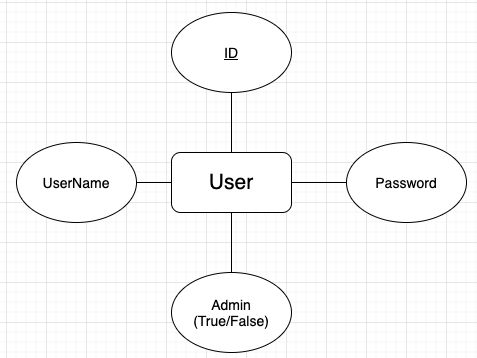

# Sketchy Database

## Users

it consist of 3 entities, which include username (primary key), password, and admin(True/False)



The schema will look something like this in sql

```psql
CREATE TABLE usr(
    userName CHAR(20) UNIQUE NOT NULL PRIMARY KEY,
    Password CHAR(20) NOT NULL,
    admin BOOLEAN NOT NULL
);
```

Create table
```psql
create table usr(userName char(20) unique not null primary key, Password char(20) not null, admin boolean not null);
```

To insert a user

```psql
insert into usr values ('yeahBoi', '1234', False);
```

To see everything in the table

```psql
select * from usr;
```

Find master user (the actual username and password for the master user)

```psql
select * from usr where admin is true;
```


Example Table (There will only be one admin)

| Username | Password | Admin | 
|----------|----------|-------|
| hellyeah | hellyeah | False
| yeahBoi7 | youHeardthatRight  | False |
| Jeez1234 | OhJeezRick | False |
| OhRightYa | OhMyGod |  False |